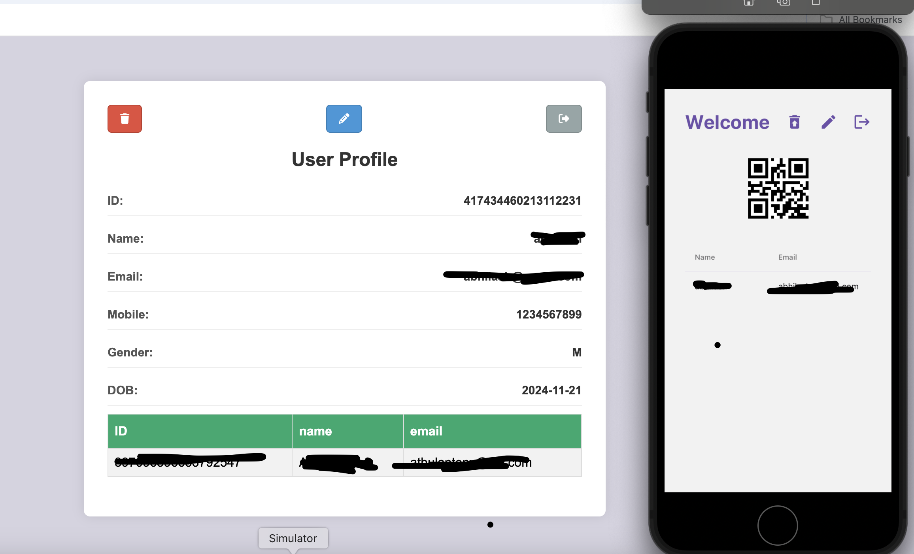

# Mobile chat application

Demo React Native hybrid mobile application which will run in both iOS and Android.



### Run the application

#### Pre installation

Delete the existing package-lock.json file and install node modules

```bash
npm install
```

Delete pod lock file and pod folder and install a fresh pod folder

```bash
cd ios && rm -rf Pods Podfile.lock && pod install
```

#### Run the application

##### Run the server (backend) first

Clone this repo and run it: https://github.com/athuldev2024/demo-app-server.

For Android

```bash
npm run android
```

For iOS

```bash
npm run ios
```
